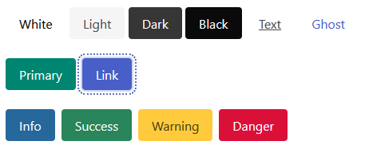

# bulma-a11y

[](https://www.npmjs.com/package/@cityssm/bulma-a11y) [](https://app.codacy.com/gh/cityssm/bulma-a11y/dashboard) [](https://ci.appveyor.com/project/dangowans/bulma-a11y) [](https://app.snyk.io/org/cityssm/project/bf65d71f-8d8b-43ba-8262-29a3c92872ef)

The [Bulma CSS framework](https://bulma.io/)
with increased colour contrast to meet accessibility requirements.



## Usage

Rather than linking to `bulma.min.css` in your webpage,
link to `bulma-a11y.min.css`.

```html
<link rel="stylesheet" href="path/to/bulma-a11y.min.css" />
```

## Test Pages

The following pages have minimal styling.
They use code samples from the official Bulma website to test for sufficient colour contrast.

- [Buttons](https://cityssm.github.io/bulma-a11y/test/server/html/buttons.html)
- [Messages](https://cityssm.github.io/bulma-a11y/test/server/html/messages.html)
- [Notifications](https://cityssm.github.io/bulma-a11y/test/server/html/notifications.html)
- [Tags](https://cityssm.github.io/bulma-a11y/test/server/html/tags.html)

## Important Note

While bulma-a11y attempts to improve colour contrast of the main Bulma components,
using bulma-a11y does not guarantee your website will be considered accessible.
